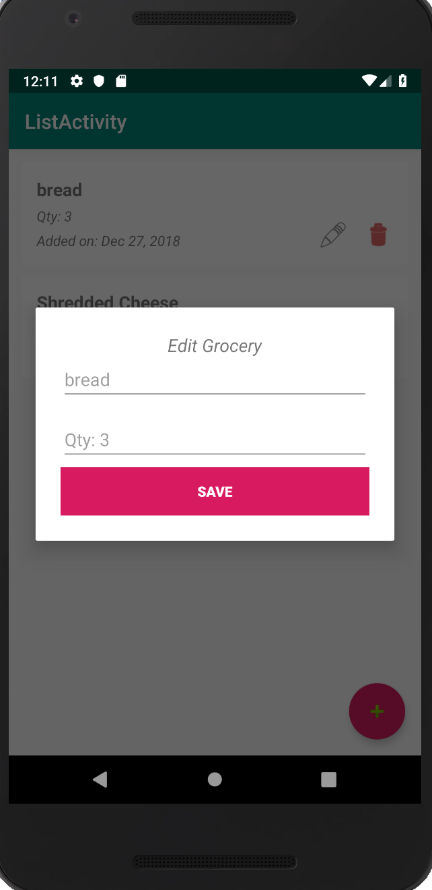

# My Grocery List Application

## Description 
An application that uses SQLiteDatabase to handle the back end for a simple grocery list application
for android devices

## Features
  ### Upon first usage you add your first item
  
  
  ### You can then add your first grocery item
  
 
  ### Example of grocery list with more items
  
  
  ### From there you can click on the trash icon to delete an item ...
  
  
  ### ... or edit an item
  
